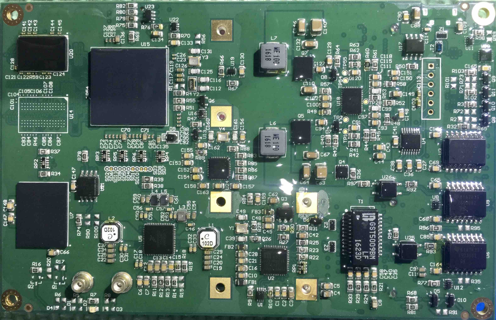
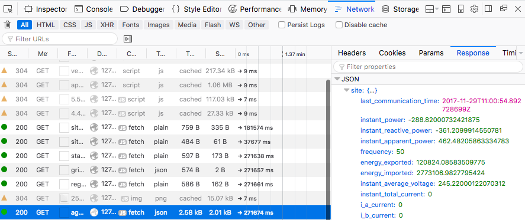

# TESLA PowerWall 2 Security Shenanigans

24h ago Elon Musk announced to build the next [TESLA Gigafactory in Germany](https://techcrunch.com/2019/11/12/elon-musk-picks-berlin-for-teslas-europe-gigafactory/), somewhere near Berlin. Here at THC we consider Berlin to be our home turf. Welcome to Berlin, Mr. Musk.❤️

Let's take a look at this TESLA Powerwall 2. Let's make sure the security is up to our standards before it is being sold to our citizens.

This is a start. Take this and take it further.

Twitter: [@hackerschoice](https://www.twitter.com/hackerschoice)  
eMail: root at thc.org

---
**EXECUTIVE SUMMARY**
1. GUI wide open.
2. Default password on WiFi and management interface
3. Attacker can cause financial damage to consumer
4. Attacker can dump entire PW Load into the grid at once
5. Attacker can oscilate between CHARGING and DUMPING (microseconds, the poor sub-station!)
6. Attacker can change grid codes.

---
**Introduction:**
The Tesla Powerwall 2 (PW) is a battery storage solution. It is often installed in combination with photovoltaic solar panels (PVs). The PW will store the PV generated power during daytime when the sun is shining and make the power available to the house when the sun is not shining. The PW can store up to 13.5kW of electric power and load/unload it at 5kW (7kW peak US / 5kW peak in the UK).

---
**Components:**
The Gateway (GW) consists of a Single Board Computer (SBC) and an energy meter (Neurio).

The SBC is custom built by WinSystems Inc and is called the G400.

The Neurio energy meter is the W1 module. It connects to the SBC via WiFi.

RS-485 is used to communicate between the SBC and the battery. Up to 10 batteries can be connected to a single GW (daisy-chain).

The research is based on GUI firmware *1.10.2* and internal firmware *Tesla-0.0.7*

The GW can  be configured to connect via Ethernet, GSM and Wifi to the Internet/Tesla-HQ. The Internet connection is used for firmware updates and for Tesla to fiddle with your PW. Tesla has unrestricted and remote management capability.



```
22/tcp open  ssh (SSH-2.0-OpenSSH_7.2)
80/tcp open  http (PW UI running here)
8306/tcp  open  Welcome to Model S hec-updater ONLINE Built for Package Version: 17.23.0 (up 28754.018395333s)
29810/tcp open  unknown
MAC ETH  Address: 00:01:45:07:31:17 (Winsystems)
MAC WiFi Address: 00:23:A7:AF:de:ad (Redpine Signals)
```
---
**PW-UI Management Interface**

The PW-GW’s management interface is accessible via WiFi. The WiFi network name is *TEG-XYZ* with XYZ being the last 3 digits of the PW’s serial number. TEG stands for ‘Tesla Energy Gateway’.

The password for the WiFi is the serial number. The serial number looks like this:

```
ST<YY><L>0001<XYZ>
```
YY is the built year and L is the revision number. I’ve seen revisions with letter D through to I. For example *ST17H0001789* would be a valid password for the Tesla PW on a WiFi network with SSID TEG-789.

The Management Interface (PW-UI) is accessible at http://192.168.91.1. The webpage will ask for a password which is again the serial number. The same management interface is accessible via the ethernet connection.

The password can not be changed. It is not possible to disable the WiFi network. I accessed mine from 50m away. It's broadcasting its SSID as well (yeha!).

**THC says: Fix it! No default passwords. Do not have the WiFi accessable unless during installation.**

---
**CT fun:**

The Tesla PW comes with two CT sensors. These are A/C current clamps that are installed around the LIVE wire of the incoming GRID line (house LIVE) and the LIVE wire of the SOLAR PV.

The Tesla PW uses these clamps to determine when to charge the PW from the Solar PV. E.g. the PW goes into charging mode when the Solar PV generate more electricity than the house uses.

The CT sensors have to be installed with the correct orientation or otherwise the GW gets an inverted (negative) reading. E.g. The GW thinks the house is exporting electricity rather than importing from the grid. Electricians do make mistakes and Tesla has this *amazing* feature to *invert the reading in software* if the installer fitted the CT clamps the wrong way around (sweet!)

In the PW-UI Management Interface this is possible by selecting the "Flip" check-box next to the CT Sensor name on the CT configuration page. 

---
**CHARGE & KILL THE GRID**

Let's flip the reading of the GRID CT Clamp in the PW-UI. Lets assume the CT Clamp reading is +1kW (e.g. that the house is drawing +1kW from the grid). After flipping the reading the GW received -1kW and believes that the energy is being exported to the grid. The PW immediately goes into chargning mode and starts charging the PW. This causes more power to be drawn from the grid (say +2kW). The CT Clamp reports this to the GW as -2kW (remember, it's flipped) and the PW ramps up charging...and draws even more power from the grid..and so on and so on...until it's charging at full load of +5kW. All this happenes within microseconds. **WARNING: The battiery gets hot very quickly and the fans start spinning at full power**

There are other fun CT Clamp Flip Combinations. Another combination forces the PW to dump it's entire charge back into the grid - all at once of course.

The Problem:
1. Here in the UK we have night rate and day rate for electricty. Night rate is usually 300% cheaper and the PW is charged by night. Now an attacker can trick the PW to charge at day-rate and dump the load into the grid at night-rate, causing a financial loss to the consumer.
2. The default password is crap. It's 2019. This should not happen. An attacker can access multiple Tesla PW's at the same time. Does anyone know how the grid feels if all Tesla PW's start dumping their load back into the grid? I can also quickly change between CHARGING and DUMPING. It's really quick. We are talking sub-second switching between CHARGING and DUMPING. How does the grid feel about me oscilating this and who will die first, the PW or the sub-station?
3. It is little understood that Tesla can do all this from their HQ. By this I mean any attacker or employee with the right access to Tesla HQ can put all PW's worldwide into CHARGING and DUMPING and oscilating between these two very quickly (sub-second).  

**THC says: Err, do not cause any harm**

---
**So much more to research**

The PW-UI managment interface has lots of other features which we have not explore (yet). It's possible to play with the grid codes such as forcing the PW into 60Hz or lowering/increasing the allowed export amperage or voltage. *Someone really should take a look at this....*

Imagine what somebody could to with access to the PW GW single board computer...and thus being able to send raw commands via the rs485 to the batteries....

Looks like the ssh version might be vulnerable to [username enumeration](https://bugfuzz.com/stuff/ssh-check-username.py). Also somebody should check serial console and vga/keyboard on the PCB.

---
**Automate your attack**

The PW-UI is a web-based interface. A simple Python script can be used to trigger any type of commands remotely. A lot of commands are uncodumented. The best way to get a list of commands is to have the Mozilla Network Monitor running during setup and testing.

---
**Interesting API calls**

Most API calls are available without authentication. Auth is required for most API calls that write to the system. It's HTTP BASIC AUTH using the same password as the WiFi password.

```
GET API calls:
/api/status              # Shows start_tie, up_time, version, git_hash
/api/system_status/grid_faults
/api/system_status/soe   # Shows percentage
/api/config
/api/config/completed
/api/customer
/api/sitemaster/stop     # Stops the PW
/api/sitemaster/run      # Starts the PW
/api/customer/registration
/api/installer
/api/meters
/api/meters/aggregates  # Info about CTS and loads)
/api/meters/readings
/api/networks
/api/networks/wifi_security_types
/api/operation
/api/powerwall
/api/powerwalls/status 
/api/site_info
/api/sitemaster         # Shows running, uptime, connected_to_tesla...
/api/solar
/api/status
/api/system_status/grid_faults
/api/system/testing
/api/system/update/status
```

```
POST API calls:
/api/customer/registration/legal
/api/customer/registration/skip
/api/installer
/api/login/Basic
/api/meters/{CTS ID}/invert_cts
/api/networks/default_gsm/disable
/api/operation
/api/powerwalls
/api/powerwalls/update
/api/site_info/timezone timezone: Europe/London
/api/site_info/grid_code
/api/site_info/grid_code
/api/site_info/site_name
/api/site_info/timezone
/api/system/testing
/api/system/networks/conn_tests


```

Example:
```
/api/site_info/grid_code
```
|variable|value|
|------|-------|
|grid_code|50Hz_230V_1_G59:UK|
|region|G59 21A|

Do not try any of these Grid Codes (really, please do not):
```
AU ASS4777.2
DE VDE4105
UK GA59 21A, GA83 16A
IT CEI-021
NZ NZS47772
US: IEEE1547 Split Phase 240V 60Hz
```

```
/api/installer
```

Tesla Installer Account Numbers are sequential and can be retrieved with *api/installer/companies*. Example: Installer 1681 is *ZSD Solar GmbH*. This is how the installer can see your Tesla Installation and disable your tesla remotely. Good idea to change this :>

|variable|value|
|--------|-----|
|Company|THC|
|customer_id| 31337|
|phone|0123456789|

```
GET api/config
GET api/customer
GET completed
GET api/logout
```

---
**Hacking Environment**

A list of some tips and tricks. Some parts are optional and not needed to hack the PW.

Part 1:
Place the PW on its own dedicated network behind a linux router. This will allow us to capture all network traffic between the PW and the Internet. 

Part 2:
Run the PW-UI Wizard and write down all values. Disable GSM to prevent any further firmware upgrade and to prevent Tesla from fiddling with your PW.

Part 3:
We use the web browser ‘Mozilla’. Go to “about:config" and delete the value in ‘network.http.accept-encoding’. This will make it easier to read captured network traffic between our browser and the PW:


Part 4:
In Mozilla open the Network Monitor by pressing ‘Cmd+Opt+E’ (Windows: Ctrl+Shift+E). That's all it takes these days. This will allow us to inspect every request to the PW UI and read the response.



---
At Your Service,

**The Hacker's Choice**


